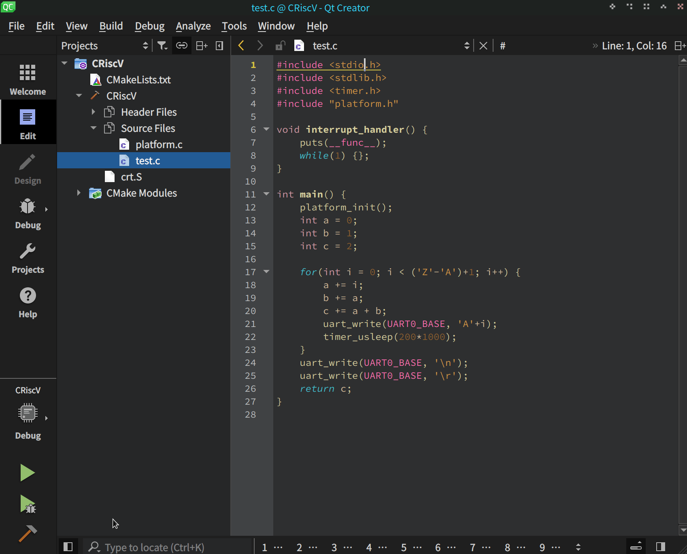
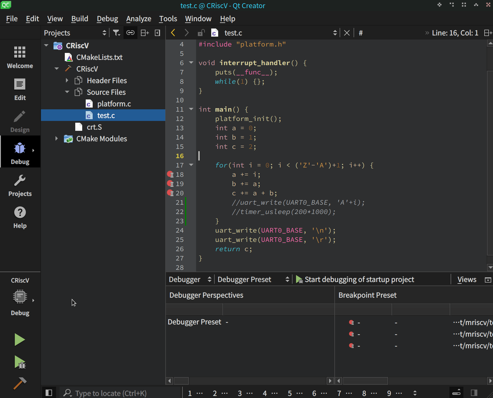

# RVDE
As a C/C++ developer for many years, I hate all kinds of the same old turtle Eclipse development tools, if you are like me, welcome to try this QtCreator-based IDE.

## Features

- [x] QtCreator C/C++IDE editor
- [x] OpenOCD debugging tools
- [x] Integrated serial port
- [x] cmake 
- [x] GCC

## Screenshots
- Run the program

- Step debugging
